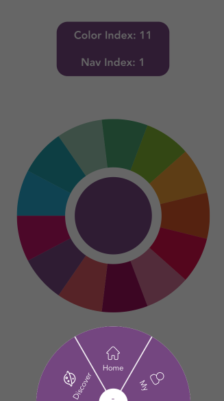

# vue-circle-choice

> A circular color choice and navigation with Vue.js

> 

## Demo

可以在 [dev](https://github.com/xandeer/vue-circle-choice/tree/dev) 分支查看详细示例，在线 [Demo](https://xandeer.me/vue-circle-choice/)。

## 安装

``` bash
npm install vue-circle-choice --save
```

## 引入

### 作为全局组件使用

``` javascript
// 在项目入口文件
import Vue from 'vue';
// 圆环型取色盘
import choiceColor from 'vue-circle-choice';
// 半圆型导航
import circularNav from 'vue-circle-choice';

Vue.component('choiceColor', choiceColor);
Vue.component('circularNav', circularNav);
```

### 作为局部组件使用

``` javascript
// 在某个组件中
import choiceColor from 'vue-circle-choice';
import circularNav from 'vue-circle-choice';

export default {
  components: {
    choiceColor,
    circularNav,
  },
};
```

## API

### choice-color

#### Props

| 参数 | 类型 | 说明 |
| ------ | ---- | ---- |
| colors | Array | 圆环各部分背景色 |
| radius | String | 圆环半径 |

#### Events

| 事件名 | 参数 | 说明 |
| ---- | ---- | ---- |
| updateColor | { index, color } | index: 按钮的索引;   color: 按下按钮的颜色 |

#### 示例

使用 `pug` 代码：
``` pug
choice-color(:colors='colors', radius="10em", @updateColor='updateColor')
```

使用 `html` 代码：
``` html
<choice-color :colors='colors' radius='10em' @updateColor='updateColor'></choice-color>
```

组件数据及自定义事件：
``` javascript
const colors = [
  '#1ba6cc',
  '#189ba7',
  '#98c6ae',
  '#45a270',
  '#7cb325',
  '#eb9826',
];

data() {
  return {
    colors,
    index: 0,
    color: this.colors[0],
  };
},
methods: {
  updateColor({ index, color }) {
    this.index = index;
    this.color = color;
  },
}
```

### circular-nav

#### Props

| 参数 | 类型 | 说明 |
| ------ | ---- | ---- |
| color | String | 圆环背景色 |
| radius | String | 圆环半径 |
| navs | Array[Object] | 各项导航设置，都是可选，具体如下 |
|      | href | `href` 属性，默认为 `javascript:void(0)` |
|      | label | 导航名称 |
|      | icon | 字体图标类名，已添加 `iconfont` |

#### Events

| 事件名 | 参数 | 说明 |
| ---- | ---- | ---- |
| updateNav | index | 导航的索引 |

#### 示例

使用 `pug` 代码：
``` pug
circular-nav(:navs='navs', :color='color', radius="8em", @updateNav='updateNav')
```

使用 `html` 代码：
``` html
<circular-nav :color='color' radius='8em' :navs='navs' @updateNav='updateNav'></circular-nav>
```

组件数据及自定义事件：
``` javascript
const navs = [{
  label: 'Discover',
  href: 'javascript:void(0)',
  icon: 'icon-discover',
}, {
  label: 'Home',
  href: 'javascript:void(0)',
  icon: 'icon-home',
}, {
  label: 'My',
  href: 'javascript:void(0)',
  icon: 'icon-my',
}];

data() {
  return {
    index: 0,
    color: '#1ba6cc',
    navs,
  };
},
methods: {
  updateNav(index) {
    this.index = index;
  },
}
```

## bug和建议

如果在使用中遇到问题或者建议，欢迎提`issues`。